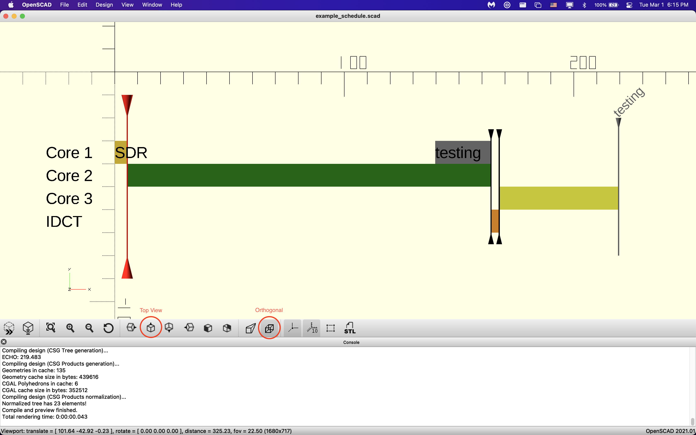

# ece_423_draw_schedule

A hastily put together tool to draw ECE 423 schedules accurately in OpenSCAD

## Setup

1. Install Openscad
   - Mac Users and Brew: `brew install openscad`
   - Executable Download: https://openscad.org/
2. Install OpenSCAD VSCode syntax highlighter through VSCode Extensions (By Antyos)
3. Open example_schedule.scad and scheduler_helpers.scad in VSCode
4. Using OpenSCAD program, open example_schedule.scad

## Tips

- Have the "console" viewport open, as it informs you of syntax errors
- This tool was intended to work in 2D
  - Enable "Orthogonal View"
    - Bottom Bar, 4th icon from the right
  - Click "Top" to make your view to 2D
    - Bottom Bar, 9th icon from the left
- Navigation Tips
  - Scroll in and out to zoom
  - Right click and drag to pan around
- Have the Cheat Sheet open at all times (if trying to write new code or functions)
  - https://openscad.org/cheatsheet/index.html
- There are a ton of color presets, if you care to use them
  - https://en.wikibooks.org/wiki/OpenSCAD_User_Manual/Transformations#color
